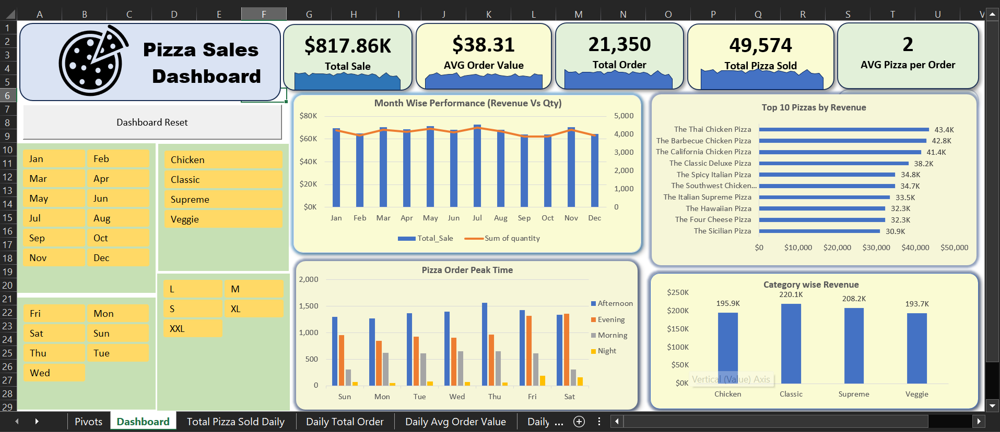

# 🍕 Pizza Sales Dashboard (Excel Project)

## 🔹 Project Overview

This project is an **interactive Pizza Sales Dashboard built in Microsoft Excel** that provides a complete overview of business performance.
It allows users to analyze sales trends, order patterns, product performance, and customer behavior using dynamic filters and visualizations.

---

## 🔹 Dashboard Highlights

The dashboard focuses on key business metrics and answers important questions like:

* How are sales performing month-wise?
* Which pizzas generate the most revenue?
* What are the peak order times?
* Which category contributes the most revenue?

---

## 🔹 Key KPIs

* 💰 **Total Sales:** $817.86K
* 📊 **Average Order Value:** $38.31
* 🧾 **Total Orders:** 21,350
* 🍕 **Total Pizzas Sold:** 49,574
* 📦 **Avg Pizzas per Order:** 2

---

## 🔹 Features & Visualizations

### 📈 Month-wise Performance (Revenue vs Quantity)

* Combo chart showing **monthly sales trend**
* Helps identify **seasonality and growth patterns**

---

### 🏆 Top 10 Pizzas by Revenue

* Highlights best-performing products:

  * Thai Chicken Pizza (~43.4K)
  * Barbecue Chicken Pizza (~42.8K)
  * California Chicken Pizza (~41.4K)
* Useful for **product strategy & promotions**

---

### ⏰ Pizza Order Peak Time Analysis

* Orders segmented into:

  * Morning
  * Afternoon
  * Evening
  * Night
* 📌 **Afternoon & Evening** show highest order volume
* Helps in **staff planning & operations optimization**

---

### 🍕 Category-wise Revenue

* Classic Category leads (~220K)
* Followed by:

  * Supreme (~208K)
  * Chicken (~195K)
  * Veggie (~193K)
* Useful for **menu planning & inventory decisions**

---

## 🔹 Filters (Interactive Slicers)

The dashboard includes dynamic slicers for:

* 📅 Month (Jan–Dec)
* 🍕 Category (Chicken, Classic, Supreme, Veggie)
* 📆 Day of Week
* 📦 Pizza Size (S, M, L, XL, XXL)

👉 Users can easily drill down into specific segments

---

## 🔹 Tools & Techniques Used

* Microsoft Excel
* Pivot Tables & Pivot Charts
* Power Query (Data Cleaning & Transformation)
* Power Pivot (Data Modeling)
* DAX (Measures & Calculations)
* Slicers (Interactive Filters)
* KPI Cards (Custom Design)
* Dashboard UI/UX Design

---

## 🔹 Business Insights

* 📈 Consistent sales performance with noticeable monthly variation
* 🏆 Few top products contribute significantly to total revenue
* ⏰ Peak ordering happens during Afternoon & Evening
* 🍕 Classic category dominates overall sales

---

## 🔹 How to Use

1. Download the Excel file from this repository
2. Open in Excel (2016 or later recommended)
3. Use slicers to filter data dynamically
4. Explore insights through charts and KPIs

---

## 🔹 Files Included

* 📁 Excel Dashboard File (.xlsm)
* 🖼️ Dashboard Screenshot

---

## 🔹 About Me

Aspiring **Data Analyst / Power BI Developer** skilled in:

* Advanced Excel
* Power BI
* SQL
* Data Analysis & Dashboard Creation

---

🔹 Use Cases
* Sales Performance Analysis
* Data Analyst Portfolio Project
* MIS Reporting Practice

---

## 🔹 Connect With Me

👉  [LinkedIn](https://www.linkedin.com/in/mohit-singh-yadav/)
👉  [GitHub](https://github.com/Unknowndevil98)

---

⭐ If you found this project useful, don’t forget to **star this repository**!
